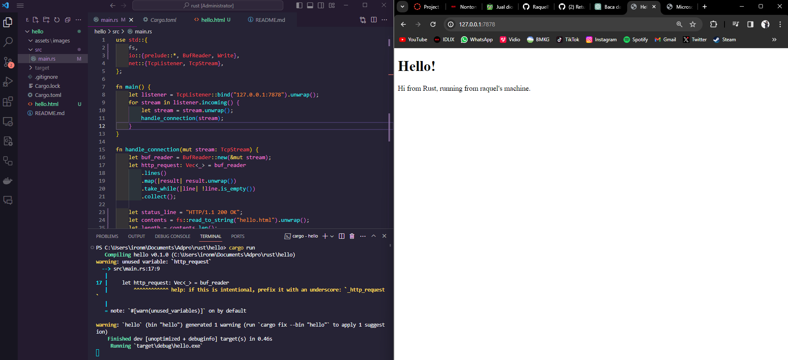
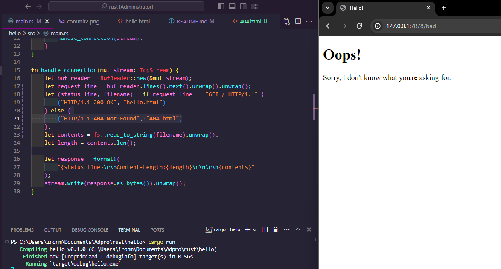

# Rust Webserver Tutorial

### Commit 1 Reflection

Fungsi `handle_connection()` pada baris pertama membaca data dari TcpStream yang diberikan melalui parameter stream.

Pada baris kedua, data yang dibaca "diparsing". Metode pertama `lines()` membagi data berdasarkan baris baru dan mengembalikan iterator. Metode kedua map() akan menjalankan closure untuk setiap elemen dalam iterator sebagai argumen. Setiap baris akan di-unwrap dan mengembalikan iterator elemen yang telah ditransformasi. Metode ketiga `take_while()` akan menjalankan closure dengan setiap elemen dalam iterator sebagai argumen dan hanya akan menghasilkan elemen jika closure mengembalikan true. Metode terakhir `collect()` mengubah iterator menjadi kumpulan, dalam hal ini kita menentukan bahwa kita ingin `Vec(_)`.

Baris terakhir hanya mencetak data. Tanda `?` menandakan bahwa cetakan ini dimaksudkan untuk debugging, sedangkan `#` berarti untuk mencetak data secara rapi.

---

### Commit 2 Reflection

---

### Commit 3 Reflection

Saya melakukan refactor dengan menggunakan pernyataan if saat menginisialisasi baris status untuk respons dan nama file HTML untuk mengurangi kode yang berulang.

